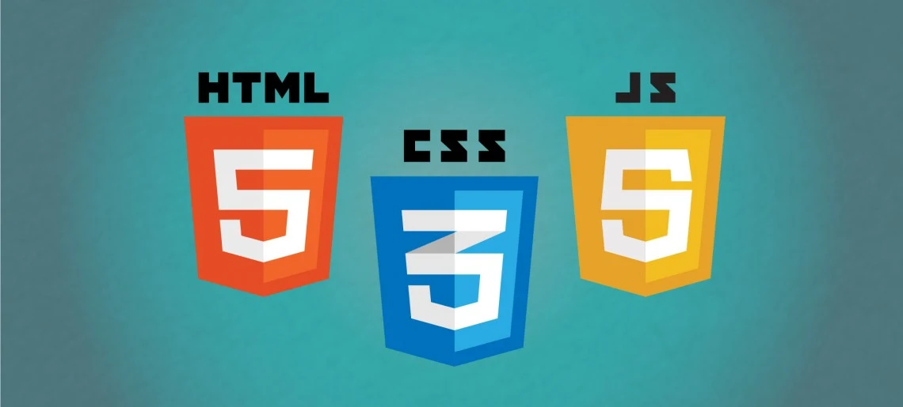

# MINI E-COMMERCE: BAGS AND PURSES 

Proyect carried out as an integrating project for Advanced Javascript course from IT Education.  

## Technologies: 

## Project objectives: 

- Show elements in a simple way (with innerHtml). Until now I had been working with appendChild. 
- Work with map method which I had never used before. 
- Work with different ways of product searches: 
  1. By an input, searching for products according to user seted input. 
  2. By brand name.
  3. By price range. 
- Sort searches from lowest to highest and from highest to lowest. 
- Create a shopping cart in which the selected items are entered.
- Option to add or remove products from shopping cart. 
- Calculate the total amounts with and without delivery.